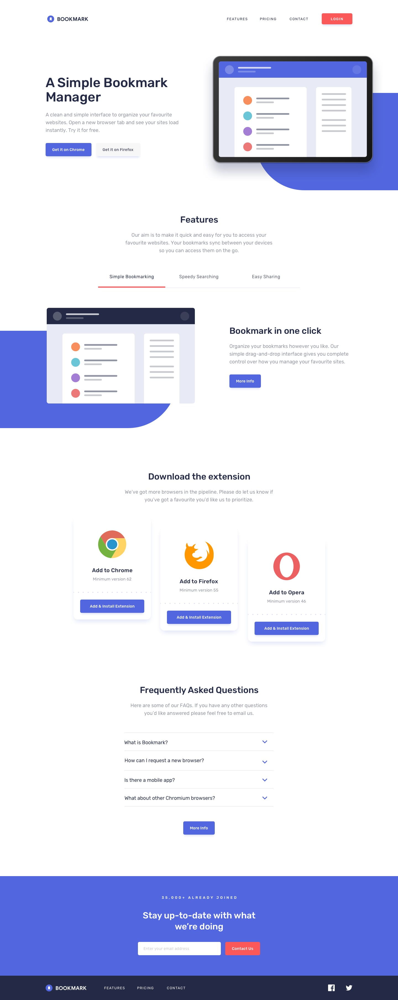

#S1. Maquetación

## 📄 Descripción

Este proyecto consiste en el desarrollo de la landing page de la extensión Bookmark basado en el diseño que aparece a continuación, con un enfoque en la práctica y el aprendizaje de HTML, CSS, Sass y Tailwind para maquetación y diseño responsive.

  

Ramas:
 - main (rama principal)
 - develop
 - feature/vanilla: landing page en CSS y HTML.
 - feature/sass: landing page en Sass
 - feature/tailwind: landing page en Tailwind.

💻 Tecnologías Utilitzadas
* HTML
* CSS

📋 Requisitos
N/A

🛠️ Instalación
N/A

▶️ Execución
N/A

🌐 Desplegamiento
1. Prepara el entorno de producción.
2. Sube los archivos del proyecto al servidor.
3. Configura el servidor para apuntar a la base de datos de producción.

🤝 Contribuciones
Les contribuciones son bienvenidas! Por favor, sigue los siguientes pasos para contribuir:
1. Haz un Fork del repositorio
2. Crea una nueva rama   git checkout -b feature/NovaFuncionalitat
3. Haz tus cambios y commitealos:   git commit -m 'Afegeix Nova Funcionalitat'
4. Sube los cambios a la nueva rama:   git push origin feature/NovaFuncionalitat
5. Haz un pull request
